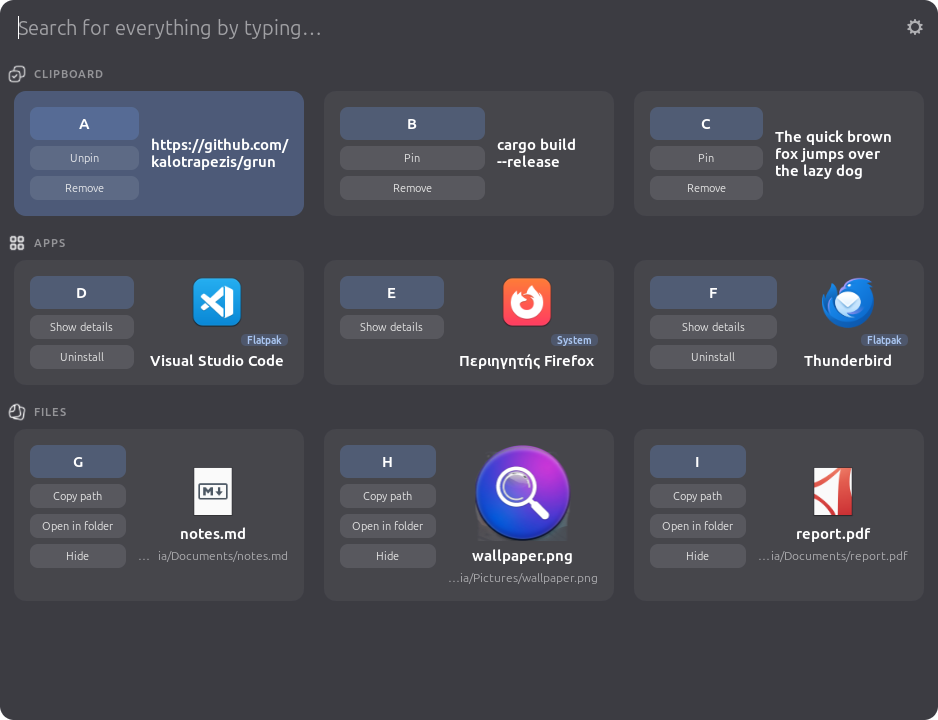

<div align="center">


# grun

**A fast, keyboard-driven application launcher for Linux — inspired by KDE's KRunner, built to feel at home on Cinnamon / Linux Mint.**

[](LICENSE)




</div>

## What is grun?

grun is **not** a port of KRunner (KRunner is Qt/KDE to its core). It's a fresh,
native **GTK4** app written in **Rust** that borrows KRunner's best idea — a
search box that finds *everything* — and adds a clipboard manager, file search,
and a grid dashboard, all driven from the keyboard.

It's desktop-environment independent (no Cinnamon/KDE/GNOME specific
dependencies), so while it's tuned for Cinnamon/Mint it runs on any GTK desktop.

## Features

- 🚀 **App launcher** — fuzzy search over your installed apps, with package-type
  tags (Flatpak / Snap / AppImage / System) and per-app actions.
- 🌐 **Layout-independent search** — type in *any* keyboard layout. The keys are
  matched across layouts, so `βοττλεσ` finds *Bottles* and `μαστερ.πδφ` finds
  *master.pdf*. It looks at the letters, not the language.
- 🔡 **Typo tolerance** — `thunderbrid` still finds Thunderbird.
- 📋 **Clipboard manager** — text and image history, pin your favourites, remove
  what you don't want. Runs in the background.
- 📁 **File search** — fuzzy filename search across your home folder, real
  MIME-type icons, image thumbnails, and `*.pdf`-style wildcards.
- 🧮 **Calculator** — type `12 * (3 + 4)`, press Enter to copy the result.
- 🔎 **Web & more** — Google/DuckDuckGo search, run a shell command, hand a query
  to Claude — every function is reorderable and can be toggled off.
- 🏠 **Dashboard** — an empty search box shows your recent clipboard, most-used
  apps, and recent files as a 3×3 grid.
- ⌨️ **Fully keyboard driven** — see [Keyboard](#keyboard) below.
- ⚙️ **Configurable** — reorder/disable every function and every per-result
  action, choose the pop-up position, auto-focus delay, and more.

## Install

### From the `.deb` (Debian / Ubuntu / Linux Mint)

```bash
sudo apt install ./grun_0.0.1_amd64.deb
```

This installs the binary, a desktop entry, and the app icon. Dependencies
(`libgtk-4-1`, `xclip`, `xdotool`) are pulled in automatically.

### Build from source

You need the Rust toolchain and the GTK4 development libraries.

```bash
# GTK4 dev libs + tools (Mint / Ubuntu / Debian)
sudo apt install libgtk-4-dev build-essential xclip xdotool

# Rust (if you don't have it)
curl --proto '=https' --tlsv1.2 -sSf https://sh.rustup.rs | sh
source "$HOME/.cargo/env"

# Build & run
cargo build --release
./target/release/grun
```

Build your own `.deb` with `bash packaging/build-deb.sh`.

## Usage

grun runs **resident**: the first launch starts it (hidden) and it stays alive.
Because it's single-instance, every later `grun` invocation **toggles** the
window — so one keybinding becomes a show/hide toggle.

Bind it in **Cinnamon → Keyboard → Shortcuts → Custom Shortcuts**: add a shortcut
with the command `grun` and assign it e.g. `Ctrl+Alt+A`. Add `grun` to **Startup
Applications** (or enable *Start on login* in settings) so it's ready after boot.

### Keyboard

- **Type** to search. **Enter** runs the top result.
- **Tab** / **↓** enter navigation mode and select the first row.
- In navigation mode:
  - **A–Z** select that lettered row.
  - **1–9** run the selected row's numbered action (e.g. a file's
    `1 Copy path`, `2 Open in folder`, `3 Hide`).
  - **↑ / ↓ / Tab** move the selection · **Enter** runs it · **Esc** returns to
    typing (Esc again hides the window).
- Mouse works too: click a row to run it, click a chip for that action.

## Configuration

Open settings with the ⚙ gear. You can:

- Enable/disable and **reorder** every function (Apps, Files, Calculator, Web,
  Claude, Run command) — order = priority.
- Reorder/disable the **per-result actions** for each category.
- Choose the **pop-up position** (top / center / bottom).
- Pick what the **home dashboard** shows (clipboard on/off, apps & files by
  *most used* or *recent*).
- Set an **auto-focus delay** so the result list takes focus after you stop
  typing.
- Toggle **search app descriptions** (so "screenshot" finds Flameshot).
- Manage **hidden files** and restore them.

Config lives at `~/.config/grun/config`; clipboard/usage history at
`~/.local/share/grun/`. Everything stays on your machine.

## Extending

grun's functions are "providers" (its take on KRunner runners). Adding one is a
single file in [`src/providers/`](src/providers) implementing the `Provider`
trait, registered in `Registry::from_config`.

## License

[GPL-3.0-or-later](LICENSE) © kalotrapezis
